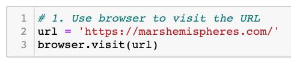
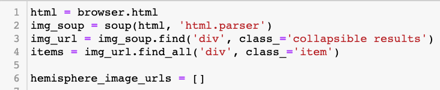
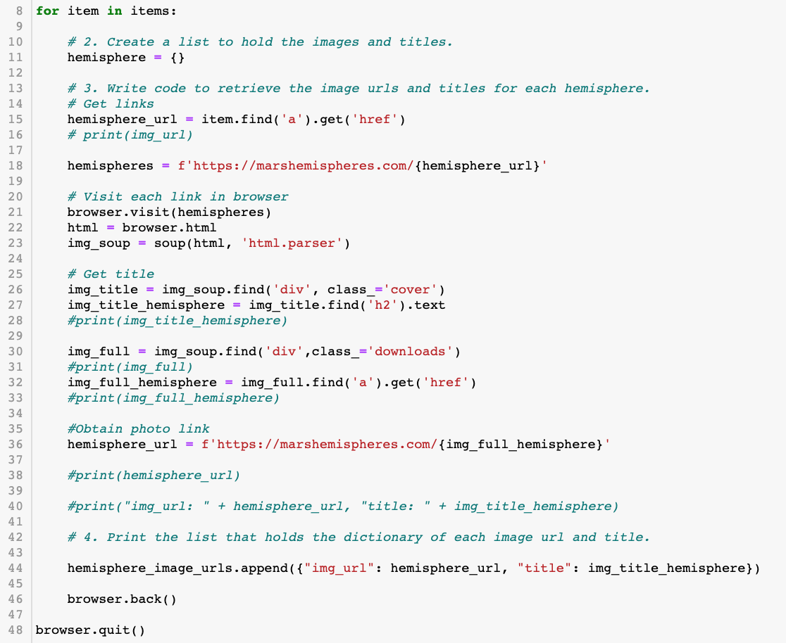
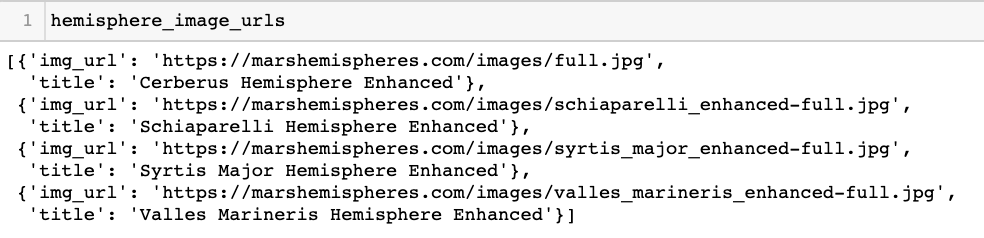
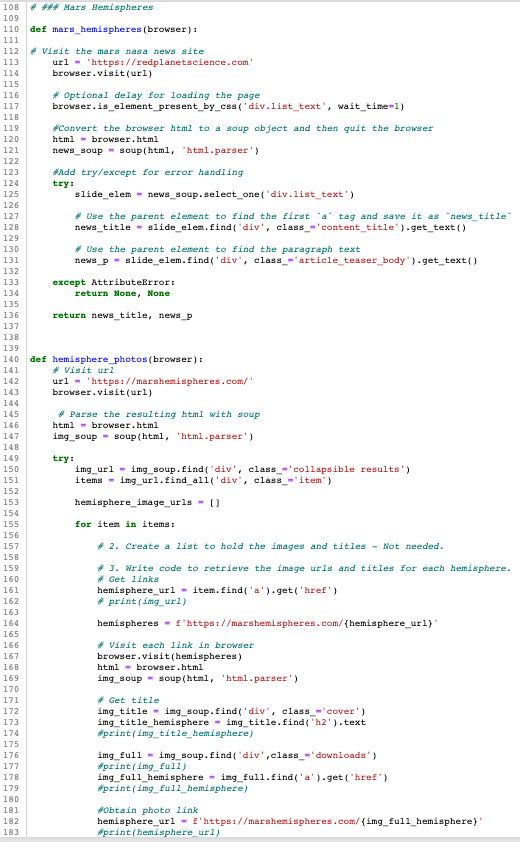
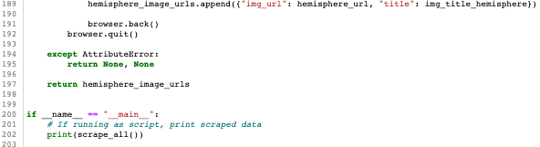
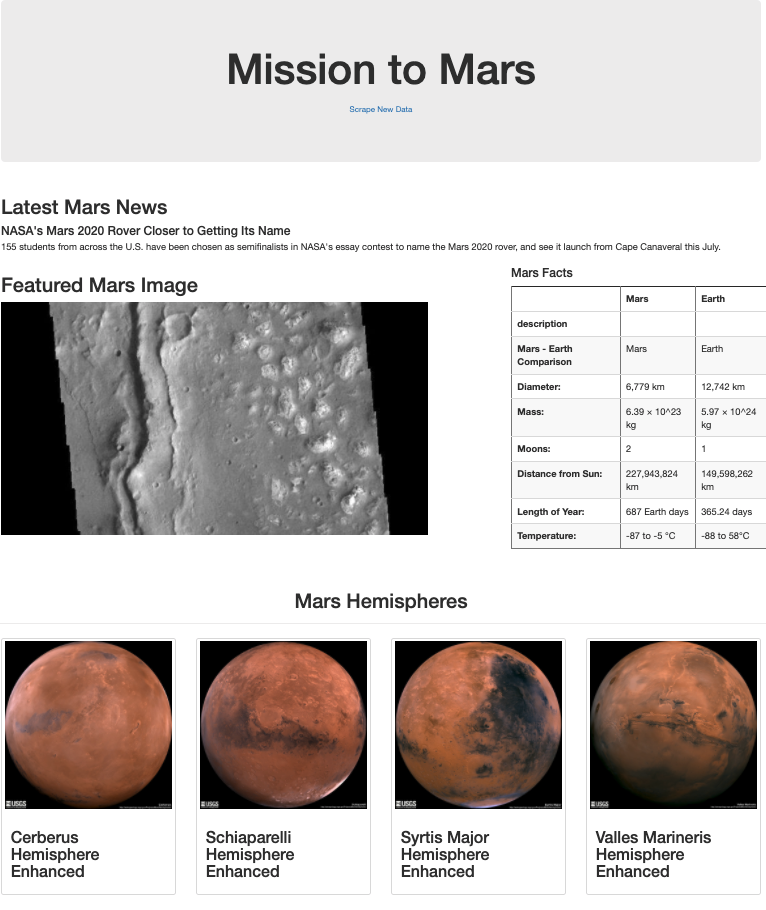

# Mission-to_Mars
Let's travel to Mars!

The following repository consists of all of the elements that are necessary to scrape a website containing likable images of the four Mars hemispheres. We then take these images and apply them to the web app that we have already created for our client Robin that contains other featured images. 

In order to obtain these images: 
  - I had to get to the initial url containing the links to all four hemispheres on the same page,
    - 
    
  - create an empty list that would hold my dictionaries that contained each hemisphere's image and title,
    - 

  - start my for loop that would create each dictionary for each hemisphere's link,
    - 
    
  - This for loop:
    
    - Clicks the first hemisphere's link 
    - Searches for the full image link of that specific hemisphere and then search for the hemisphere's title 
    - Creates and store the first dictionary for this first hemisphere's information
    - Goes back to the previous browser to continue the process again for the remaining three links
    - Exits the loop and then do a final print to ensure that our list is printing correctlyin roder to apply it to the web app
    - Once the loop is exited, it then exits the browser 
  
  - After the loop has fully processed, all of the created dictionaries are then stored as one full list outside of the loop that will be utilized in the scraping.py file in order to obtain the images and then place them on the web app to Robin's taste.
    - 

Once all of these steps are completed that obtains the hemisphere images, we then tidy up Robin's web app by making it mobile-responsive, and then adding a couple of bootstrap components to finish off the site.
- 
- 

As all of these tasks are all done, the website app is good to go!
- 
